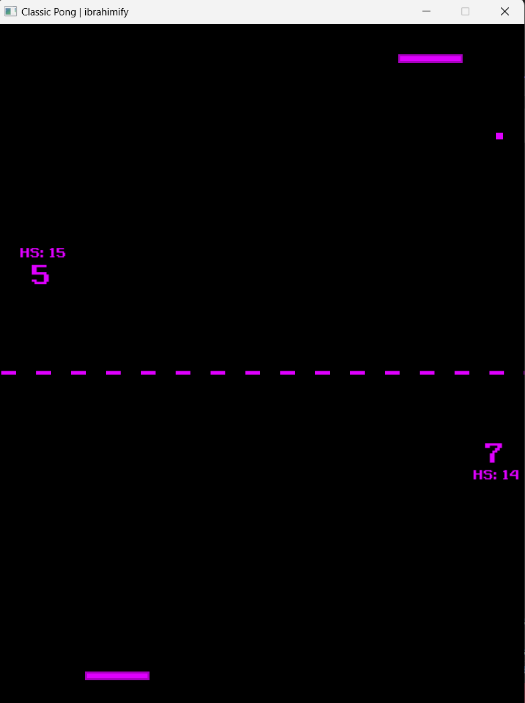

# Pong Game using SFML

A classic two-player Pong game implementation using C++ and SFML library.

### Game Play Interface 



## Overview

This is a modern implementation of the classic Pong arcade game where two players control paddles to hit a ball back and forth across the screen. The game features score tracking, high score management, and smooth gameplay mechanics.

## System Requirements

### Hardware Requirements
- Processor: Any modern processor (Intel Core i3/AMD equivalent or better)
- RAM: 4 GB minimum
- Graphics: Any graphics card supporting OpenGL 2.0
- Storage: 100 MB free space

### Software Requirements
- Windows 10 or later
- Visual Studio 2022 (Community Edition or higher)
- SFML 2.6.0 or later

## SFML Setup Guide

### Step 1: Download SFML
1. Go to https://www.sfml-dev.org/download.php
2. Download SFML 2.6.0 for Visual Studio 2022 (64-bit)
3. Extract the downloaded file to a location you can easily find (e.g., `C:\SFML-2.6.0`)

### Step 2: Set Up Visual Studio Project
1. Open Visual Studio 2022
2. Create a new project or open this project
3. Right-click on the project in Solution Explorer
4. Select "Properties"
5. Make sure "All Configurations" is selected
6. Under "C/C++ → General → Additional Include Directories" add:
   ```
   C:\SFML-2.6.0\include
   ```
7. Under "Linker → General → Additional Library Directories" add:
   ```
   C:\SFML-2.6.0\lib
   ```
8. Under "Linker → Input → Additional Dependencies" add:
   ```
   sfml-graphics.lib
   sfml-window.lib
   sfml-system.lib
   sfml-audio.lib
   ```

### Step 3: Copy DLL Files
1. Go to `C:\SFML-2.6.0\bin`
2. Copy all .dll files
3. Paste them into your project's Debug and Release folders (where your .exe is generated)

## Features

- Two-player local gameplay
- Real-time score tracking
- High score system with file persistence
- Smooth paddle and ball physics
- Modern graphics using SFML

## Controls

- **Player 1 (Bottom Paddle)**: Left/Right Arrow Keys
- **Player 2 (Top Paddle)**: A/D Keys
- **Exit Game**: Escape Key or close window

## Project Structure

```
pong/
│
├── src/                      # Source files
│   ├── Pong.cpp  # (main.cpp)
│   ├── Paddle.cpp
│   ├── Ball.cpp
│   └── GameStats.cpp
│
├── include/                 # Header files
│   ├── Paddle.h
│   ├── Ball.h
│   └── GameStats.h
│
├── assets/                  # Game assets
│   ├── fonts/
│   └── screenshots/ 
│
├── docs/                    # Documentation
│   └── documentation.pdf
│
├── .gitignore               # Git ignore file
├── README.md                # README to check usage
└── Pong.sln                 # Visual Studio solution file
```
## Classes

### Paddle Class
- Manages paddle position and movement
- Handles paddle collision detection
- Controls paddle speed and direction

### Ball Class
- Controls ball movement and physics
- Manages ball collision detection
- Handles speed and direction changes

### GameStats Class
- Manages scoring system
- Handles high score file I/O
- Tracks game statistics

## How to Play
1. Build and run the project in Visual Studio 2022
2. Use the controls mentioned above to move the paddles
3. Try to hit the ball past your opponent's paddle to score points
4. First player to reach the target score wins
5. High scores are automatically saved

## Common Issues and Solutions

1. **SFML DLL Error**: 
   - Make sure all SFML .dll files are in the same folder as your .exe
   - Verify you're using the correct SFML version (2.6.0)

2. **Build Errors**:
   - Double-check SFML include and library paths in project properties
   - Ensure you're building for x64 platform

3. **Game Not Starting**:
   - Verify all required files are present
   - Check Windows Event Viewer for any error messages

## Author

Muhammad Ibrahim Shoeb  
BSc in Computer Science Engineering, BME  
OZLVV3

## References

1. Horton, J. (2019). Beginning C++ Game Programming - Second Edition. Packt Publishing Pvt Ltd.
2. Fonts sourced from: www.1001freefonts.com

## Contributing

Feel free to fork the project and submit pull requests for any improvements.
